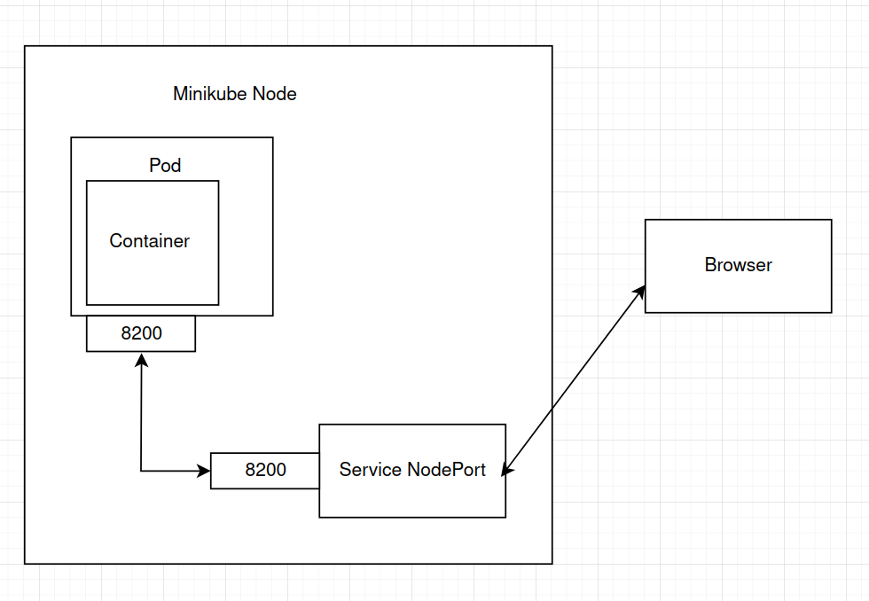

### University: [ITMO University](https://itmo.ru/ru/)
### Faculty: [FICT](https://fict.itmo.ru)
### Course: [Introduction to distributed technologies](https://github.com/itmo-ict-faculty/introduction-to-distributed-technologies)
### Year: 2024/2025
### Group: K4111c
### Author: Stepanov Mikhail Andreevich
### Lab: Lab1
### Date of create: 30.11.2024
### Date of finished: 30.11.2024

#### Описание

Это первая лабораторная работа в которой вы сможете протестировать Docker, установить Minikube и развернуть свой первый "под".

#### Цель работы

Ознакомиться с инструментами Minikube и Docker, развернуть свой первый "под".

#### Выполнение

1. Были установлены Docker и minikube. Далее развернут minikube cluster в docker среде при помощи команды `minikube start`

2. Написан манифесь для развертывания пода HashiCorp Vault, версии 1.13.3 (последняя открытая версия)

3. Запуск пода в minikube: 
```shell
minikube kubectl -- create -f vault.yaml
minikube kubectl -- get pods
```


4. Далее сразу проверяем логи для поиска токена доступа, с которым был инициализирован под
```shell
minikube kubectl -- logs vault
```


4. Для получения доступа к веб-интерфейсу сервиса Vault необходимо было прокинуть его сервисные порты для доступа из вне среды выполнения

Данной командой был создан сервис типа NodePort для обеспечения доступа к порту 8200.
```shell
minikube kubectl -- export pod vault --type=NodePort --port=8200
```
Далее была вызвана команда соединения сервисного порта и системного порта между собой
```shell
minikube kubectl -- port-forward service/vault 8200:8200
```

5. Далее была произведена авторизация в веб-интерфейсе с полученными данными из логов
Результат:


####  Схема организации контейнеров
