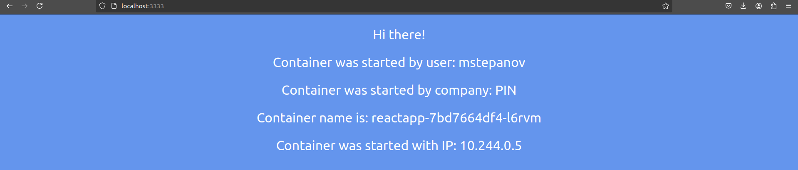
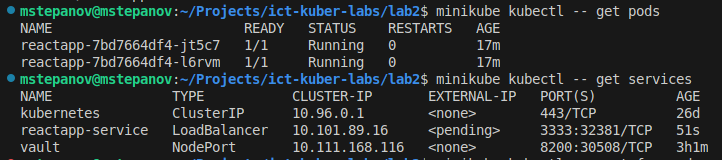
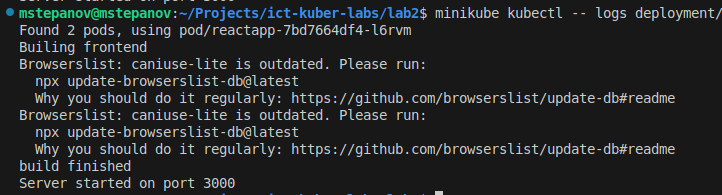
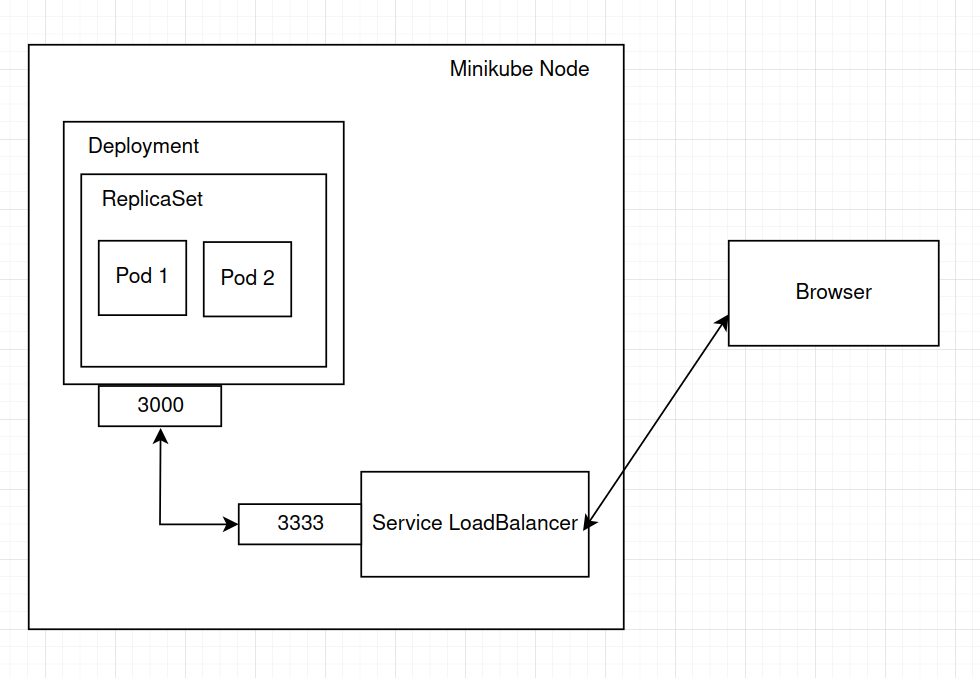

### University: [ITMO University](https://itmo.ru/ru/)
### Faculty: [FICT](https://fict.itmo.ru)
### Course: [Introduction to distributed technologies](https://github.com/itmo-ict-faculty/introduction-to-distributed-technologies)
### Year: 2024/2025
### Group: K4111c
### Author: Stepanov Mikhail Andreevich
### Lab: Lab2
### Date of create: 30.11.2024
### Date of finished: 30.11.2024

#### Описание 

В данной лабораторной работе вы познакомитесь с развертыванием полноценного веб сервиса с несколькими репликами. 

#### Цель работы

Ознакомиться с типами "контроллеров" развертывания контейнеров, ознакомится с сетевыми сервисами и развернуть свое веб приложение.

#### Выполнение

1. Был написан манифест дял развертывания предоставленного React-приложения в 2 реплики. В конфигурации были заданы переменные окружения `REACT_APP_USERNAME` и `REACT_APP_COMPANY_NAME` для подов. Данными командами был запущен Deployment для их развертывания и проверка корректности развертывания.
```shell
minikube kubectl -- create -f deployment.yaml
minikube kubectl -- get pods
```
2. Далее был реализован сервис типа LoadBalancer для обеспечения доступа к подам приложения. Сервис обеспечивал доступ с порта 3333 на порт приложения 3000. 
```shell
minikube kubectl -- create -f service.yaml
```
3. Для получения доступа к приложению из веб-браузера было добавлено назначение сервисного порта 3333 на аналогичный системный порт
```shell
minikube kubectl -- port-forward service/reactapp-service 3333:3333
```

Результат:




5. Была осуществлена проверка логов развернутых контейнеров
```shell
minikube kubectl -- logs deployment/reactapp
```
Результат:




####  Схема организации контейнеров

