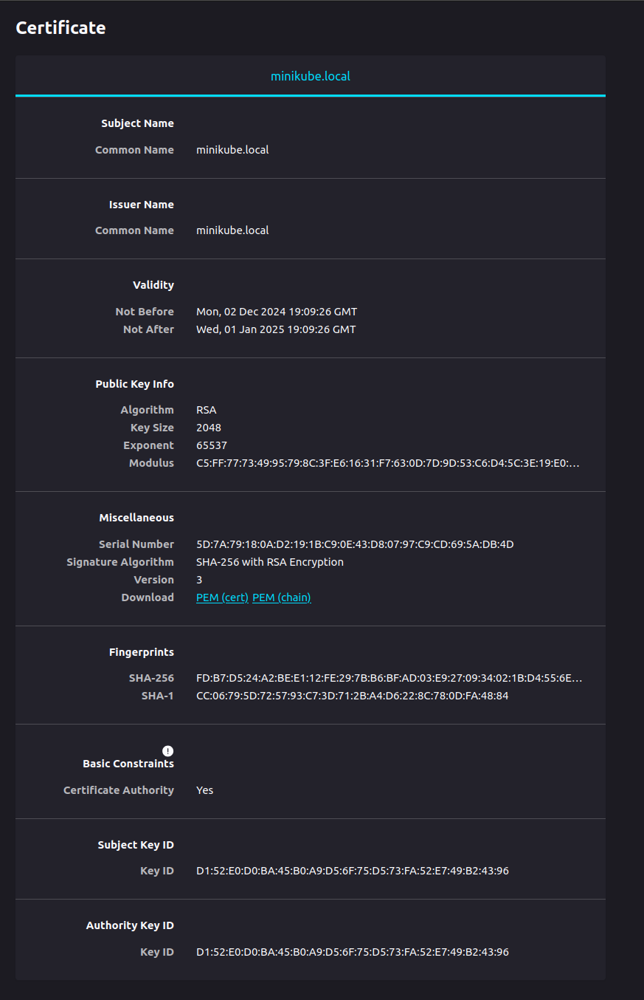

### University: [ITMO University](https://itmo.ru/ru/)
### Faculty: [FICT](https://fict.itmo.ru)
### Course: [Introduction to distributed technologies](https://github.com/itmo-ict-faculty/introduction-to-distributed-technologies)
### Year: 2024/2025
### Group: K4111c
### Author: Stepanov Mikhail Andreevich
### Lab: Lab3
### Date of create: 01.12.2024
### Date of finished: 02.12.2024

#### Описание

В данной лабораторной работе вы познакомитесь с сертификатами и "секретами" в Minikube, правилами безопасного хранения данных в Minikube.

#### Цель работы

Познакомиться с сертификатами и "секретами" в Minikube, правилами безопасного хранения данных в Minikube. 

#### Выполнение

1. Были подготовлены манифесты (config-amp, replicaset, service) для развертывания двух подов предоставленного приложения в формате ReplicaSet. Команды развертывания:
```shell
minikube kubectl -- create -f config-map.yaml
minikube kubectl -- create -f replicaset.yaml
minikube kubectl -- create -f service.yaml
```
Результат:


2. TLS сертификат можно выпустить для конкретного адреса. Для назначения адреса среде minikube был получен внутренний IP minikube. Внесены изменения в `/etc/hosts`, для IP minikube назачен адрес `minikube .local`

3. При помощи утилиты `openssl` был выпущен SSL сертификат для имени `minikube.local` 
```shell
openssl req -x509 -nodes -days 30 -newkey rsa:2048 -keyout minikube.local.key -out minikube.local.crt -subj "/CN=minikube.local"
```
4. Далее был добавлен секрет в хранилище Kubernetes и развернут объект Ingess для обеспечения SSL соединения с `minikube.local`
```shell
minikube kubectl -- create secret tls minikube.local.secret --cert=minikube.local.crt --key=minikube.local.key
minikube kubectl -- create -f ingress.yaml
```


Результат:


Информация о сертификате:



####  Схема организации контейнеров
