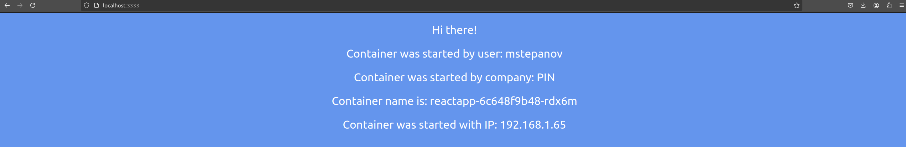
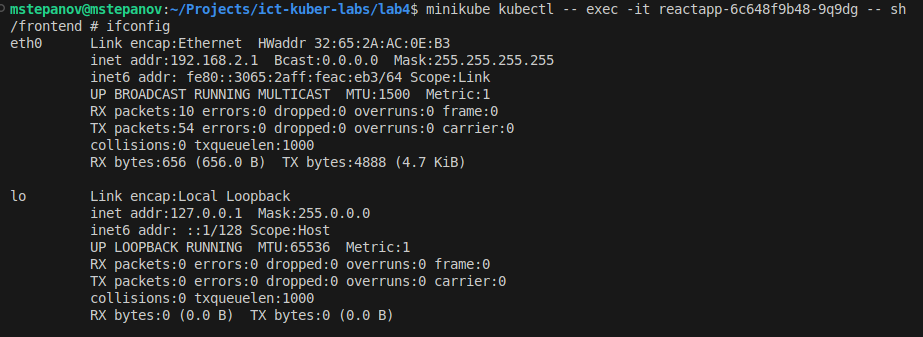

### University: [ITMO University](https://itmo.ru/ru/)
### Faculty: [FICT](https://fict.itmo.ru)
### Course: [Introduction to distributed technologies](https://github.com/itmo-ict-faculty/introduction-to-distributed-technologies)
### Year: 2024/2025
### Group: K4111c
### Author: Stepanov Mikhail Andreevich
### Lab: Lab4
### Date of create: 02.12.2024
### Date of finished: 04.12.2024

#### Описание

Это последняя лабораторная работа в которой вы познакомитесь с сетями связи в Minikube. Особенность Kubernetes заключается в том, что у него одновременно работают underlay и overlay сети, а управление может быть организованно различными CNI.

#### Цель работы

Познакомиться с CNI Calico и функцией IPAM Plugin, изучить особенности работы CNI и CoreDNS.

#### Выполнение

1. Изначально необходимо было развернуть minikube в формате двух нод с использованием сетевого плагина CNI Calico.

```shell
minikube start --network-plugin=cni --cni=calico --nodes 2
```


Minikube был успешно развернут в двухнодовом режиме, также была осуществлена дополнительная проверка 
```shell
minikube kubectl -- get pod -A -l k8s-app=calico-node
```


3. Для корректной настройки сетевого взаимодействия ндо необходимо было задать индентифицирующие лейблы для каждой из нод. Были назначены лейблы в соответствии с географической зоной.
```shell
minikube kubectl -- label node minikube zone=MSK
minikube kubectl -- label node minikube-m02 zone=KRAT
```


4. Внутри kubernetes уже определены дефолтные сетевые настройки по формированию IP-адресов. Их необходимо удалить для определения нового алгоритма формарования пулов IP-адресов в соответствии с разделением по лейблам.
```shell
minikube kubectl -- delete ippools default-ipv4-ippool
minikube kubectl -- apply -f ippool.yaml
```


В ходе использования спецификации ippool версии 3 были получены ошибки. После получения информации о текущей установленной версии были внесены коррективы в манифест и заданы новые правила для IPPool. 

5. Далее было осуществлено развертывание инфраструктуры для приложений и самих приложений в формате двух подов.
```shell
minikube kubectl -- create -f config-map.yaml
minikube kubectl -- create -f deployment.yaml
minikube kubectl -- create -f service.yaml
```

Также было осуществлено назначение внутреннего порта 3333 на системный аналогичный порт для получения доступа к веб-интерфейсу.
```shell
minikube kubectl -- port-forward service/reactapp 3333:3333
```



6. После того как была проверена работоспособность развернутых подов, необходимо было убедиться в корректности сетевых настроек.

Для этого была запущена среды исполнения shell внутри одного подов и вызвана команда `ifocnfig` для получения настроек контейнерых сетевых интерфейсов.


текущий контейнер располагался в подсети, отличной от того, которая была по данным из веб-интерфейса, поэтому была вызвана команда `ping 192.168.1.65` для проверки связи между контейнерами.

Результат:


Те же самые действия были произведены из второго пода.

Результат:


####  Схема организации контейнеров
